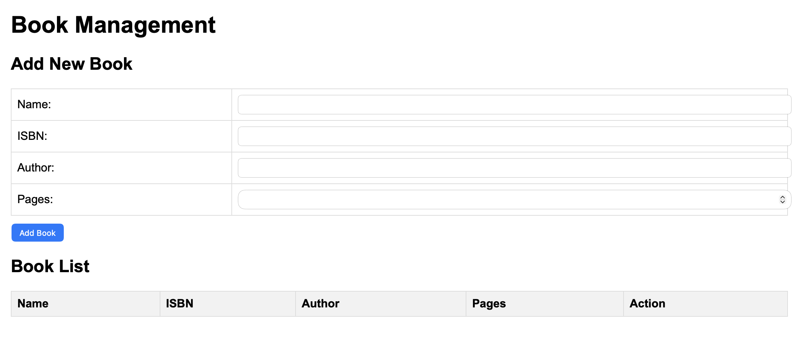
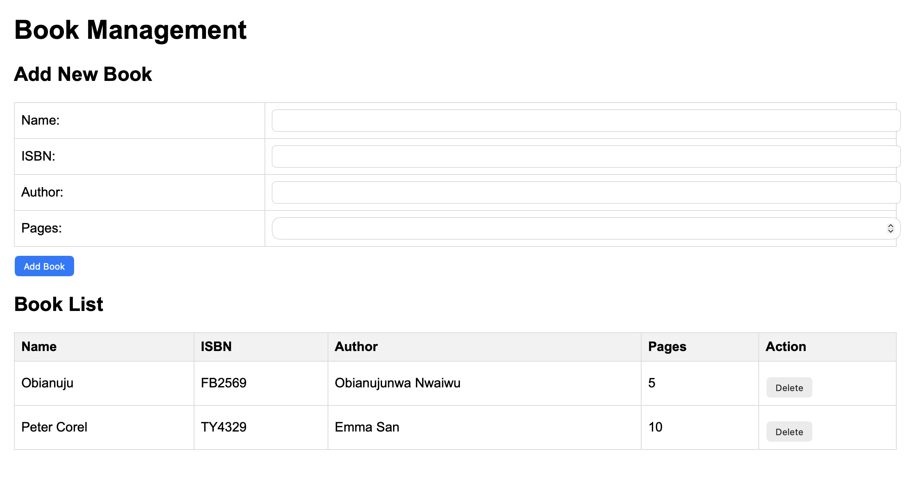
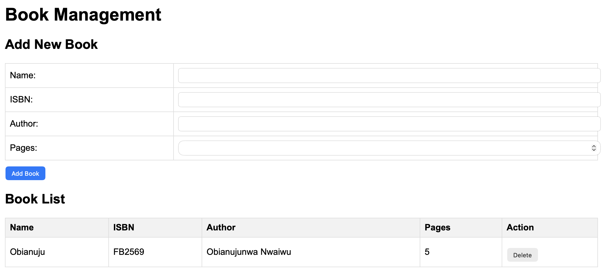

# 📚 Book Management Application (MEAN Stack)

## 📌 Project Overview
This project is a simple **Book Management Application** built using the **MEAN stack (MongoDB, Express, Angular, Node.js)**.

The aim of this project is to demonstrate how a frontend interface interacts with a backend server and a database. Users can add books, view them in a list, and delete them when needed.

---

## 🏗️ How the Application Works
The application follows a basic full-stack flow:

- The user interacts with the interface (form and table)
- The frontend sends requests to the backend server
- The server processes the request using Express
- Data is stored or retrieved from MongoDB
- The updated result is displayed back on the interface

---

## 🛠️ Technologies Used
- **MongoDB** – stores book data  
- **Express.js** – handles server-side logic and API routes  
- **Node.js** – runs the backend server  
- **Angular / Static Frontend UI** – handles user interaction  
- **Mongoose** – connects the application to MongoDB  

---

## 📁 Project Structure
Books/
├── server.js # Main server file
├── apps/
│ ├── routes.js # API routes
│ └── models/
│ └── book.js # Book schema
├── public/ # Frontend interface
│ └── index.html
├── screenshots/ # Images used in documentation
```

---

## 🚀 Features
- Add a new book using a form  
- Display all books in a table  
- Delete a book from the list  
- Store and retrieve data from MongoDB  
- Simple and clean user interface  

---

## 📸 Screenshots

### Application Interface


### Add Book


### Book List


---

## 🌐 API Functionality

The application uses RESTful API endpoints handled by Express:

- **GET /book** → Retrieves all books from MongoDB and displays them in the UI  
- **POST /book** → Adds a new book when the user submits the form  
- **DELETE /book/:isbn** → Removes a book when the delete button is clicked  

These operations are triggered through the frontend interface.

---

## ▶️ How to Run the Project

### 1. Install dependencies
```bash
npm install

```
---
## Start MongoDB

```bash
sudo systemctl start mongod

```
---
## Run the application

```bash
node server.js

```
---
## Open in browser
```
http://localhost:3300

```

🧠 What I Learned
While working on this project, I learned:
How to structure a full-stack application
How to create and use API routes with Express
How to connect Node.js to MongoDB using Mongoose
How frontend and backend communicate using HTTP requests
How to implement basic CRUD operations

